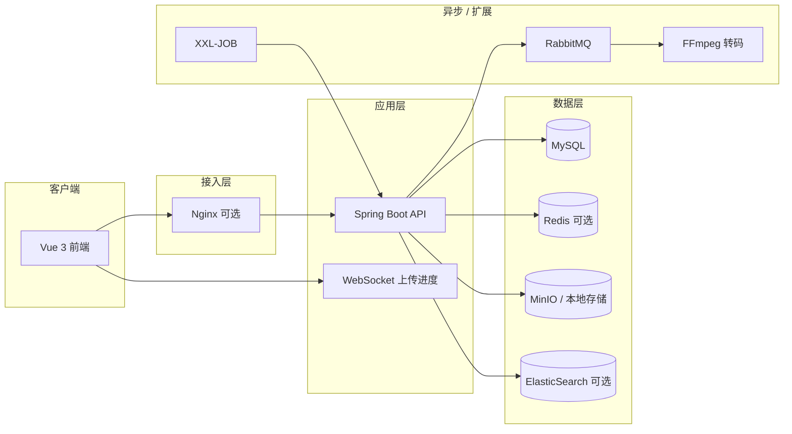

# CloudDisk Pro

企业级智能云盘系统，前后端分离架构。支持大文件分片上传、秒传、分享、在线预览/编辑、团队空间与企业级扩展组件。

| 服务 | 地址 |
|------|------|
| 前端 | http://localhost:5173 |
| 后端 API | http://127.0.0.1:8088 |
| 接口文档 | http://127.0.0.1:8088/doc.html |
| 健康检查 | http://127.0.0.1:8088/actuator/health |
| 默认账号 | `admin` / `admin123` |

---

## 目录

- [技术栈](#技术栈)
- [功能概览](#功能概览)
- [架构](#架构)
- [环境要求](#环境要求)
- [环境配置](#环境配置)
- [快速开始](#快速开始本地-dev)
- [VS Code / Cursor 启动](#vs-code--cursor-启动)
- [Docker 依赖栈](#docker-依赖栈)
- [常用配置](#常用配置)
- [前端路由](#前端路由)
- [API 一览](#api-一览)
- [测试与 CI](#测试与-ci)
- [目录结构](#目录结构)
- [相关文档](#相关文档)

---

## 技术栈

| 层级 | 技术 |
|------|------|
| 前端 | Vue 3 · TypeScript · Vite · Pinia · Element Plus · pdf.js · video.js · WebSocket |
| 后端 | Spring Boot 3.2 · Sa-Token · MyBatis Plus · MySQL 8 · Knife4j |
| 缓存 | Redis（本地/生产默认启用；`local,memory` 可降级内存） |
| 存储 | MinIO / 本地磁盘 |
| 消息 | RabbitMQ（可选，异步转码） |
| 搜索 | MySQL LIKE / ElasticSearch（可选） |
| 监控 | Spring Boot Admin · SkyWalking · ELK（可选） |

---

## 功能概览

| 模块 | 能力 |
|------|------|
| 用户中心 | 注册登录、图形验证码、头像、个人信息；RBAC（`USER` / `ADMIN`） |
| 文件 | 上传/下载/重命名/移动/复制；MD5 秒传、分片、断点续传；最大 20GB |
| 文件夹 | 多级目录、树形导航、面包屑；文件夹级联回收站 |
| 分享 | 文件/文件夹分享、提取码、过期时间；分享页预览（pdf.js / video.js / OnlyOffice 只读） |
| 预览 | 图片/PDF/视频；FFmpeg 转码 H.264 + 封面；OnlyOffice 在线编辑 |
| 搜索 | MySQL 模糊搜索；ES 全文 + 拼音（profile `es`） |
| 团队空间 | 创建团队、成员邀请/移除、团队文件共享（`/teams`） |
| 通知 | 站内通知列表、未读计数、已读标记 |
| 安全 | BCrypt、登录失败锁定、图形验证码、API/IP 限流、Sentinel QPS、分享防暴力破解；ClamAV（可选） |
| CDN | MinIO 预签名直链 + CDN 域名替换，预览/下载优先走直链 |
| 管理后台 | 仪表盘、用户管理、存储统计、ES 索引重建、审计日志（`/admin`） |
| 企业扩展 | FFmpeg · RabbitMQ · XXL-JOB · Sentinel · OnlyOffice · LDAP/SSO · 监控/ELK |

---

## 架构



---

## 环境要求

| 依赖 | 版本 |
|------|------|
| JDK | 17+ |
| Maven | 3.8+ |
| Node.js | 18+ |
| MySQL | 8.x |
| MinIO | 最新稳定版（或使用 Docker Compose） |

**可选：** Redis · RabbitMQ · ElasticSearch · FFmpeg · OnlyOffice · ClamAV

---

## 环境配置

数据库 **`cloud_disk`**，默认账号/密码 **`root` / `root`**。完整建表脚本见 [`sql/init.sql`](sql/init.sql)（含 `cloud_disk` 业务库 + `xxl_job` 调度库）。

| Profile | 场景 | MySQL | Redis 密码 | 说明 |
|---------|------|-------|-----------|------|
| `local` | 本地开发 | 3306 | 无 | MinIO + **Redis**（与本机 6379 对齐） |
| `local,memory` | 无 Redis 降级 | 3306 | — | 纯内存缓存与 Token |
| `docker` | Compose 依赖 | **3307** | 无 | 连接 Docker 映射端口 |
| `prod` | 服务器（**默认**） | 3306 | **root** | 启用 Redis 缓存 |

配置文件：

| 文件 | 说明 |
|------|------|
| [`application-local.yml`](backend/src/main/resources/application-local.yml) | 本地开发 |
| [`application-docker.yml`](backend/src/main/resources/application-docker.yml) | Docker 依赖栈 |
| [`application-prod.yml`](backend/src/main/resources/application-prod.yml) | 生产环境 |

**可选 profile**（叠加在 local/prod/docker 上）：

`redis` · `mq` · `es` · `xxl` · `onlyoffice` · `monitoring` · `elk` · `ldap` · `sso` · `clamav`

生产环境变量：

| 变量 | 说明 |
|------|------|
| `CLOUDDISK_DB_HOST` / `CLOUDDISK_DB_PORT` | MySQL 地址 |
| `CLOUDDISK_REDIS_HOST` / `CLOUDDISK_REDIS_PORT` / `CLOUDDISK_REDIS_PASSWORD` | Redis |
| `CLOUDDISK_MINIO_ENDPOINT` / `CLOUDDISK_MINIO_BUCKET` | MinIO |
| `CLOUDDISK_CORS_ORIGIN` | 前端域名（CORS） |
| `CLOUDDISK_STORAGE` | 本地存储根目录 |

---

## 快速开始（本地 Dev）

```bash
# 1. 启动 MinIO（或使用下方 Docker Compose）
minio server ./data --console-address ":9001"
# 控制台 http://127.0.0.1:9001 创建桶 cloud-disk

# 2. 初始化数据库
mysql -uroot -proot < sql/init.sql

# 3. 后端
cd backend
mvn spring-boot:run -Dspring-boot.run.profiles=local

# 4. 前端
cd frontend
npm install && npm run dev
```

浏览器访问 http://localhost:5173 ，使用 `admin` / `admin123` 登录。

---

## VS Code / Cursor 启动

`.vscode/launch.json` 已配置，按 **F5** 选择：

| 配置 | 说明 |
|------|------|
| **后端 Prod** | 服务器 profile（默认项） |
| **后端 Dev** | 本地 profile |
| **前端 Dev** | Vite :5173，代理后端 :8088 |
| **全栈 Prod** | 后端 Prod + 前端 Dev 同时启动 |
| **全栈 Dev** | 后端 Dev + 前端 Dev 同时启动 |

> **Dev** = 本地开发，**Prod** = 服务器环境。修改连接信息请编辑 `launch.json` 中对应 `env`。

---

## Docker 依赖栈

```bash
# 启动 MySQL(3307) / Redis / MinIO / RabbitMQ / ES 等
docker compose -f deploy/docker-compose.yml up -d

# 初始化数据库
mysql -uroot -proot -h127.0.0.1 -P3307 < sql/init.sql

# 后端连接 Docker
cd backend && mvn spring-boot:run -Dspring-boot.run.profiles=docker
```

按需启用可选组件：

```bash
docker compose -f deploy/docker-compose.yml \
  --profile xxl --profile sentinel --profile onlyoffice --profile monitoring up -d
```

端口与组件说明见 **[deploy/部署指南.md](deploy/部署指南.md)**。

---

## 常用配置

| 配置项 | 说明 |
|--------|------|
| `clouddisk.storage.type` | `minio` 或 `local` |
| `clouddisk.minio.bucket` | 存储桶（默认 `cloud-disk`） |
| `clouddisk.redis.enabled` | Redis 缓存 + Sa-Token 持久化 |
| `clouddisk.cdn.enabled` | CDN 直链加速 |
| `clouddisk.ffmpeg.enabled` | 视频转码与封面 |
| `clouddisk.sentinel.enabled` | 上传 QPS 限流（默认开） |
| `clouddisk.onlyoffice.enabled` | Office 在线编辑 |
| `clouddisk.elasticsearch.enabled` | ES 全文搜索 |
| `clouddisk.virus-scan.enabled` | ClamAV 扫描 |
| `clouddisk.rate-limit.*` | API / 登录 / 注册 / 分享限流 |

Profile 组合示例：

```bash
mvn spring-boot:run -Dspring-boot.run.profiles=local,memory  # 无 Redis 时降级内存
mvn spring-boot:run -Dspring-boot.run.profiles=local,es          # + ES 搜索
mvn spring-boot:run -Dspring-boot.run.profiles=local,mq          # + 异步转码
mvn spring-boot:run -Dspring-boot.run.profiles=local,onlyoffice  # + Office
mvn spring-boot:run -Dspring-boot.run.profiles=prod,monitoring   # 生产 + 监控
```

---

## 前端路由

| 路径 | 页面 | 权限 |
|------|------|------|
| `/login` | 登录 / 注册 | 公开 |
| `/disk` | 我的网盘 | 登录 |
| `/shares` | 我的分享 | 登录 |
| `/teams` | 团队空间 | 登录 |
| `/recycle` | 回收站 | 登录 |
| `/profile` | 个人中心 | 登录 |
| `/office/:id` | OnlyOffice 编辑 | 登录 |
| `/admin` | 管理后台 | ADMIN |
| `/share/:code` | 分享访问页 | 公开 |

---

## API 一览

| 模块 | 路径 | 说明 |
|------|------|------|
| 认证 | `/api/auth/*` | 登录、注册、验证码、LDAP/SSO、头像 |
| 文件夹 | `/api/folders/*` | 树形目录、创建、重命名、移动、删除 |
| 文件 | `/api/files/*` | 列表、上传、下载、预览、直链、搜索 |
| 上传 | `/api/upload/*` | MD5 校验、分片 init/chunk/merge、断点续传 |
| 分享 | `/api/share/*`、`/share/{code}/*` | 创建、取消、访问、预览、下载 |
| 回收站 | `/api/recycle/*` | 列表、恢复文件/文件夹 |
| 团队 | `/api/teams/*` | 团队 CRUD、成员、团队文件 |
| 通知 | `/api/notifications/*` | 列表、未读数、标记已读 |
| 存储 | `/api/storage/*` | 存储信息、用量、缓存统计 |
| 管理 | `/api/admin/*` | 仪表盘、用户、审计、ES 重建 |
| OnlyOffice | `/api/files/{id}/onlyoffice`、`/api/onlyoffice/*` | 编辑配置与回调 |
| WebSocket | `/ws/upload?token=` | 上传进度推送 |

完整接口参数见 Knife4j：http://127.0.0.1:8088/doc.html

---

## 测试与 CI

**后端单元测试：**

```bash
cd backend && mvn test
```

覆盖：文件校验、上传/分享服务、登录防护、全局异常处理等。

**前端单元测试：**

```bash
cd frontend && npm run test:unit
```

**前端构建：**

```bash
cd frontend && npm run build
```

**CI 流水线：** [`.github/workflows/ci.yml`](.github/workflows/ci.yml) — push/PR 到 `main`/`master` 时自动执行后端 `mvn test package` 与前端 `npm ci && test:unit && build`。

---

## 目录结构

```
├── backend/                    # Spring Boot 主服务
│   ├── src/main/java/          # 业务代码
│   ├── src/main/resources/     # 配置（application-*.yml）
│   └── src/test/               # 单元测试
├── frontend/                   # Vue 3 前端
│   ├── src/views/              # 页面组件
│   ├── src/stores/             # Pinia 状态
│   └── src/utils/              # 工具（上传、错误处理等）
├── sql/
│   └── init.sql                # 完整数据库脚本（唯一入口）
├── deploy/
│   ├── docker-compose.yml      # 依赖栈编排
│   ├── 部署指南.md              # 详细部署文档
│   └── nginx.conf.example      # Nginx 限流 / 反向代理示例
├── monitoring/admin-server/    # Spring Boot Admin（可选）
├── .github/workflows/ci.yml      # GitHub Actions CI
└── .vscode/                    # launch.json / settings.json
```

> `docs/` 目录存放本地设计/安全文档，已在 `.gitignore` 中排除，不随仓库提交。

---

## 相关文档

| 文档 | 说明 |
|------|------|
| [deploy/部署指南.md](deploy/部署指南.md) | Docker、MinIO、CDN、ES、FFmpeg、XXL-JOB、Sentinel、OnlyOffice、监控、SSO、Nginx |
| [deploy/nginx.conf.example](deploy/nginx.conf.example) | 生产 Nginx 配置参考（限流、反向代理） |
| [sql/init.sql](sql/init.sql) | 数据库建表与初始数据 |
