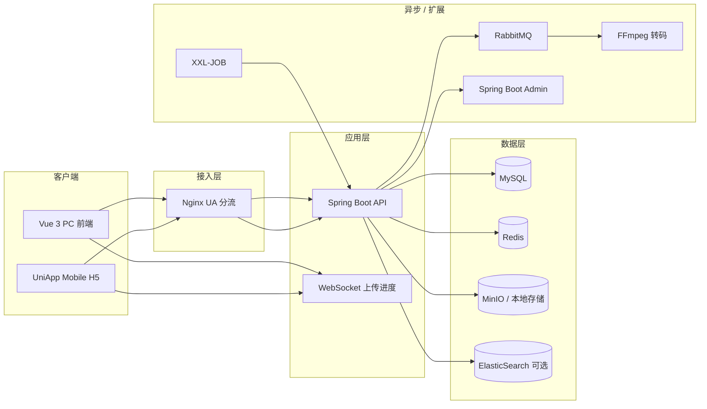
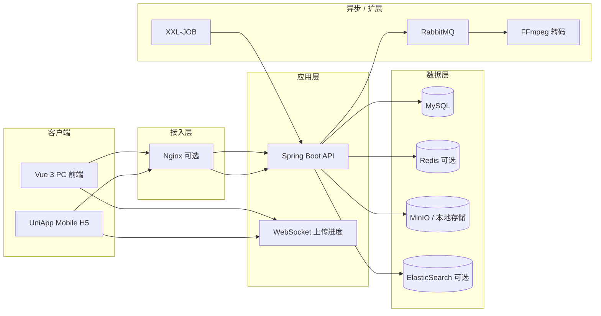

# CloudDisk Pro

企业级智能云盘系统，前后端分离架构。支持大文件分片上传、秒传、分享、在线预览/编辑、团队空间与企业级扩展组件。

| 服务 | 地址 |
|------|------|
| 前端 PC | http://localhost:5173 |
| 前端 Mobile H5 | http://localhost:5174 |
| 后端 API | http://127.0.0.1:8088 |
| 接口文档 | http://127.0.0.1:8088/doc.html |
| 健康检查 | http://127.0.0.1:8088/actuator/health |
| 监控面板 | http://127.0.0.1:8090 |
| 默认账号 | `admin` / `admin123` |

---

## 目录

- [技术栈](#技术栈)
- [功能概览](#功能概览)
- [架构](#架构)
- [环境要求](#环境要求)
- [环境配置](#环境配置)
- [快速开始（本地 Dev）](#快速开始本地-dev)
- [VS Code / Cursor 启动](#vs-code--cursor-启动)
- [Docker 依赖栈](#docker-依赖栈)
- [常用配置](#常用配置)
- [前端路由](#前端路由)
- [API 一览](#api-一览)
- [移动端（UniApp H5）](#移动端uniapp-h5)
- [测试与 CI](#测试与-ci)
- [目录结构](#目录结构)
- [相关文档](#相关文档)

---

## 技术栈

| 层级 | 技术 |
|------|------|
| 前端 PC | Vue 3 · TypeScript · Vite · Pinia · Element Plus · pdf.js · video.js · WebSocket |
| 前端 Mobile | UniApp · Vue 3 · Pinia · SCSS（H5 / 可打包 APK） |
| 后端 | Spring Boot 3.2.5 · Sa-Token 1.38 · MyBatis Plus 3.5.6 · MySQL 8 · Knife4j 4.5 |
| 缓存 | Redis（Sa-Token 独立库 + 业务缓存；`local,memory` 可降级内存） |
| 存储 | MinIO 8.5 / 本地磁盘 |
| 消息 | RabbitMQ（可选，异步转码） |
| 搜索 | MySQL LIKE / ElasticSearch 8.12 + IK + 拼音（可选） |
| 监控 | Spring Boot Admin 3.2 · SkyWalking · ELK（可选） |

---

## 功能概览

| 模块 | 能力 |
|------|------|
| 用户中心 | 注册（管理员审批）/ 登录、图形验证码、头像、个人信息；RBAC（`USER` / `ADMIN`） |
| 文件 | 上传/下载/重命名/移动/复制；MD5 秒传、分片、断点续传；最大 20GB |
| 文件夹 | 多级目录、树形导航、面包屑；文件夹级联回收站 |
| 分享 | 文件/文件夹分享、提取码、过期时间、下载计数去重；分享页预览（pdf.js / video.js / OnlyOffice 只读） |
| 预览 | 图片/PDF/视频/文本；FFmpeg 转码 H.264 + 封面；OnlyOffice 在线编辑 |
| 搜索 | MySQL 模糊搜索；ES 全文 + 拼音（profile `es`） |
| 团队空间 | 创建团队、成员邀请/接受/移除、团队头像、团队文件共享；成员可在「我的云盘」看到团队根目录 |
| 传输列表 | PC 右下角浮层 / Mobile 独立页；上传/下载队列、进度、暂停/恢复、清除已完成 |
| 通知 | 站内通知、未读角标、团队邀请接受/拒绝、注册审批通知、通知删除/清空（WebSocket 推送） |
| 安全 | BCrypt、登录失败锁定、图形验证码、API/IP 限流、Sentinel QPS、分享防暴力破解；ClamAV（可选） |
| CDN | MinIO 预签名直链 + CDN 域名替换，预览/下载优先走直链 |
| 管理后台 | 仪表盘、用户管理（注册审批/角色修改/密码重置/状态/配额）、存储统计、ES 索引重建、审计日志（`/admin`） |
| 企业扩展 | FFmpeg · RabbitMQ · XXL-JOB · Sentinel · OnlyOffice · LDAP/SSO · 监控/ELK |

---

## 架构



---

## 环境要求

| 依赖 | 版本 |
|------|------|
| JDK | 17+ |
| Maven | 3.8+ |
| Node.js | 18+ |
| MySQL | 8.x |
| MinIO | 最新稳定版（或使用 Docker Compose） |

**可选：** Redis · RabbitMQ · ElasticSearch · FFmpeg · OnlyOffice · ClamAV

---

## 环境配置

数据库 **`cloud_disk`**，默认账号/密码 **`root` / `root`**。完整建表脚本见 [`sql/init.sql`](sql/init.sql)。

| Profile | 场景 | MySQL | Redis | 说明 |
|---------|------|-------|-------|------|
| `local` | 本地开发 | 3306 | 6379（无密码） | MinIO + Redis（Sa-Token 独立 db1） |
| `local,memory` | 无 Redis 降级 | 3306 | — | 纯内存缓存与 Token |
| `docker` | Compose 依赖 | **3307** | 6379（无密码） | 连接 Docker 映射端口，全组件启用 |
| `prod` | 服务器（**默认**） | 3306 | 6379（密码 `root`） | 启用 Redis 缓存 |

配置文件：

| 文件 | 说明 |
|------|------|
| [`application.yml`](backend/src/main/resources/application.yml) | 公共基础配置 |
| [`application-local.yml`](backend/src/main/resources/application-local.yml) | 本地开发 |
| [`application-docker.yml`](backend/src/main/resources/application-docker.yml) | Docker 依赖栈 |
| [`application-prod.yml`](backend/src/main/resources/application-prod.yml) | 生产环境 |
| [`application-monitoring.yml`](backend/src/main/resources/application-monitoring.yml) | Spring Boot Admin 客户端 |

**可选 profile**（叠加在 local/prod/docker 上）：

`monitoring` · `elk` · `ldap` · `sso`

生产环境变量：

| 变量 | 说明 |
|------|------|
| `CLOUDDISK_DB_HOST` / `CLOUDDISK_DB_PORT` | MySQL 地址 |
| `CLOUDDISK_REDIS_HOST` / `CLOUDDISK_REDIS_PORT` / `CLOUDDISK_REDIS_PASSWORD` | Redis |
| `CLOUDDISK_MINIO_ENDPOINT` / `CLOUDDISK_MINIO_ACCESS_KEY` / `CLOUDDISK_MINIO_SECRET_KEY` / `CLOUDDISK_MINIO_BUCKET` | MinIO |
| `CLOUDDISK_CORS_ORIGIN` | 前端域名（CORS） |
| `CLOUDDISK_STORAGE` | 本地存储根目录 |
| `CLOUDDISK_RABBITMQ_HOST` / `CLOUDDISK_RABBITMQ_PORT` / `CLOUDDISK_RABBITMQ_USER` / `CLOUDDISK_RABBITMQ_PASS` | RabbitMQ |
| `CLOUDDISK_ES_URIS` | ElasticSearch 地址 |

---

## 快速开始（本地 Dev）

```bash
# 1. 启动依赖（二选一）
# 方式 A：Docker Compose（推荐，含 MySQL/Redis/MinIO/RabbitMQ/ES）
docker compose -f docker/docker-compose.yml up -d

# 方式 B：手动启动 MinIO
minio server ./data --console-address ":9001"
# 控制台 http://127.0.0.1:9001 创建桶 cloud-disk

# 2. 初始化数据库（Docker Compose 已自动执行，可跳过）
mysql -uroot -proot < sql/init.sql

# 3. 后端
cd backend
# Docker Compose 依赖用 docker profile（MySQL 3307）
SPRING_PROFILES_ACTIVE=docker mvn spring-boot:run -DskipTests
# 或本地 MySQL 3306 用 local profile
SPRING_PROFILES_ACTIVE=local mvn spring-boot:run -DskipTests

# 4. PC 前端
cd frontend
npm install && npm run dev

# 5. 移动端 H5（可选）
cd mobile
npm install && npm run dev:h5
```

浏览器访问 http://localhost:5173（PC）或 http://localhost:5174（Mobile H5），使用 `admin` / `admin123` 登录。

---

## VS Code / Cursor 启动

`.vscode/launch.json` 已配置，按 **F5** 选择：

| 配置 | 说明 |
|------|------|
| **后端 dev** | `local` profile（MySQL 3306 + Redis） |
| **后端 dev + 监控** | `local,monitoring` profile（含 Spring Boot Admin 客户端） |
| **后端 docker dev** | `docker` profile（连接 Docker Compose 的 MySQL 3307） |
| **前端 dev** | Vite :5173，代理后端 :8088 |
| **移动端 dev** | UniApp H5 :5174，代理后端 :8088 |
| **全栈**（复合） | 后端 dev + 前端 dev + 移动端 dev 同时启动 |

---

## Docker 依赖栈

`docker/` 目录包含完整的容器化配置：

| 文件 | 说明 |
|------|------|
| [`docker/docker-compose.yml`](docker/docker-compose.yml) | MySQL/Redis/MinIO/RabbitMQ/ES + 可选全栈（backend/nginx/admin-server） |
| [`docker/.env`](docker/.env) | Docker 环境变量（镜像仓库、代理配置） |
| [`docker/Dockerfile.backend`](docker/Dockerfile.backend) | 后端 JRE 17 镜像 |
| [`docker/Dockerfile.admin-server`](docker/Dockerfile.admin-server) | 监控 Admin Server 镜像 |
| [`docker/nginx.conf`](docker/nginx.conf) | Nginx 限流 / UA 分流 / 反向代理 / gzip |
| [`docker/elasticsearch/Dockerfile`](docker/elasticsearch/Dockerfile) | ES 8.12.2 + IK + 拼音插件 |

### 仅依赖（本机跑前后端）

```bash
docker compose -f docker/docker-compose.yml up -d
# MySQL 映射宿主机 3307，首次启动自动执行 sql/init.sql
SPRING_PROFILES_ACTIVE=docker mvn spring-boot:run -DskipTests   # backend/
npm run dev                                                        # frontend/
npm run dev:h5                                                     # mobile/
```

### 全栈部署（Nginx + 后端 + Admin 监控）

```bash
# 先构建产物
cd frontend && npm run build
cd mobile && npm run build:h5
cd backend && mvn package -DskipTests
cd monitoring/admin-server && mvn package -DskipTests

# 启动全栈
docker compose --env-file docker/.env -f docker/docker-compose.yml --profile app up -d --build
```

| 服务 | 地址 |
|------|------|
| PC / 移动端（Nginx UA 分流） | http://localhost:8080 |
| Spring Boot Admin 监控 | http://localhost:8090 |

```bash
# 停止
docker compose -f docker/docker-compose.yml --profile app down
# 查看日志
docker compose -f docker/docker-compose.yml logs -f
```

---

## 常用配置

| 配置项 | 说明 |
|--------|------|
| `clouddisk.storage.type` | `minio` 或 `local` |
| `clouddisk.minio.bucket` | 存储桶（默认 `cloud-disk`） |
| `clouddisk.redis.enabled` | Redis 缓存 + Sa-Token 持久化 |
| `clouddisk.cdn.enabled` | CDN 直链加速 |
| `clouddisk.ffmpeg.enabled` | 视频转码与封面（H.264 / AAC / 720p） |
| `clouddisk.sentinel.enabled` | 上传 QPS 限流（默认开） |
| `clouddisk.onlyoffice.enabled` | Office 在线编辑 |
| `clouddisk.elasticsearch.enabled` | ES 全文搜索 |
| `clouddisk.virus-scan.enabled` | ClamAV 扫描 |
| `clouddisk.rate-limit.*` | API / 登录 / 注册 / 分享限流 |
| `clouddisk.ldap.enabled` | LDAP 统一认证 |
| `clouddisk.sso.enabled` | SSO 单点登录 |
| `clouddisk.schedule.recycle-retain-days` | 回收站自动清理天数（默认 30） |

Profile 组合示例：

```bash
mvn spring-boot:run -Dspring-boot.run.profiles=local,memory      # 无 Redis 时降级内存
mvn spring-boot:run -Dspring-boot.run.profiles=local,monitoring   # + Spring Boot Admin
mvn spring-boot:run -Dspring-boot.run.profiles=docker             # Docker Compose 全组件
mvn spring-boot:run -Dspring-boot.run.profiles=prod,monitoring    # 生产 + 监控
```

---

## 前端路由

| 路径 | 页面 | 权限 |
|------|------|------|
| `/login` | 登录 / 注册 | 公开 |
| `/disk` | 我的网盘 | 登录 |
| `/shares` | 我的分享 | 登录 |
| `/teams` | 团队空间 | 登录 |
| `/recycle` | 回收站 | 登录 |
| `/profile` | 个人中心 | 登录 |
| `/office/:id` | OnlyOffice 编辑 | 登录 |
| `/admin` | 管理后台（仪表盘/审计日志） | ADMIN |
| `/admin/users` | 用户管理（注册审批/角色/密码/配额） | ADMIN |
| `/share/:code` | 分享访问页 | 公开 |

---

## API 一览

| 模块 | 路径 | 说明 |
|------|------|------|
| 认证 | `/api/auth/*` | 登录、注册（审批制）、验证码、LDAP/SSO、头像上传/查看、个人信息、退出 |
| 文件夹 | `/api/folders/*` | 树形目录、创建、重命名、移动、删除、面包屑 |
| 文件 | `/api/files/*` | 列表、上传、下载、预览、直链、搜索 |
| 上传 | `/api/upload/*` | MD5 校验、分片 init/chunk/merge、断点续传 |
| 分享 | `/api/share/*`、`/share/{code}/*` | 创建、取消、访问、预览、下载（IP 去重计数） |
| 回收站 | `/api/recycle/*` | 列表、恢复、级联删除/恢复 |
| 团队 | `/api/teams/*` | 团队 CRUD、成员、团队文件、邀请、团队头像 |
| 团队邀请 | `/api/team-invitations/*` | 待处理邀请、接受/拒绝 |
| 通知 | `/api/notifications/*` | 列表、未读数、标记已读/全部已读、删除、清空 |
| 存储 | `/api/storage/*` | 存储信息、用量、缓存统计 |
| 管理 | `/api/admin/*` | 仪表盘、用户列表、注册审批、角色修改、密码重置、状态/配额、存储统计、ES 重建、审计日志 |
| OnlyOffice | `/api/files/{id}/onlyoffice`、`/api/onlyoffice/*` | 编辑配置与回调 |
| WebSocket | `/ws/upload?token=` | 上传进度推送 |

完整接口参数见 Knife4j：http://127.0.0.1:8088/doc.html

---

## 移动端（UniApp H5）

与 PC 共用同一套 Spring Boot API，独立工程位于 [`mobile/`](mobile/)。开发：`cd mobile && npm run dev:h5` → http://localhost:5174

### 底部导航

| Tab | 页面 | 说明 |
|-----|------|------|
| 云盘 | `/pages/disk/index` | 文件列表/宫格、搜索、面包屑、上传/新建文件夹；头部入口进入传输列表 |
| 分享 | `/pages/shares/index` | 我的分享链接管理 |
| 团队 | `/pages/teams/index` | 团队列表、创建团队、进入团队文件 |
| 我的 | `/pages/profile/index` | 头像/容量、传输列表、通知、分享/回收站/团队入口、退出登录 |

### 其他页面

| 路径 | 说明 |
|------|------|
| `/pages/login/index` | 登录 / 注册（与 PC 账号互通，注册需管理员审批） |
| `/pages/recycle/index` | 回收站（从「我的」入口进入） |
| `/pages/teams/files` | 团队文件浏览、上传/下载/删除 |
| `/pages/teams/members` | 成员管理、邀请成员 |
| `/pages/notifications/index` | 消息通知（团队邀请/注册审批/分享通知；删除/清空） |
| `/pages/transfer/index` | 传输列表（上传/下载队列、进度、暂停/恢复） |
| `/pages/share/view` | 公开分享访问（提取码） |
| `/pages/preview/image` · `/pages/preview/video` · `/pages/preview/text` | 图片/视频/文本预览 |
| `/pages/admin/users` | 用户管理（ADMIN 权限，注册审批/角色/状态） |

### 传输列表

| 端 | 入口 | 能力 |
|----|------|------|
| PC | 网盘页右下角 `TransferPanel` 浮层 | 上传/下载队列、进度与速率、暂停/恢复上传、清除已完成 |
| Mobile | 云盘头部图标 → `/pages/transfer/index`；「我的 → 传输列表」 | 同上；H5 流式下载；进行中任务角标实时更新 |

任务状态由 Pinia [`mobile/src/stores/transfer.ts`](mobile/src/stores/transfer.ts) / [`frontend/src/stores/transfer.ts`](frontend/src/stores/transfer.ts) 统一管理。

### 团队空间（Mobile）

- 创建团队、浏览/上传/下载团队文件（成员共享访问，后端 `getOwnedOrShared` 鉴权）
- 邀请成员 → 对方在通知中心接受后成为成员
- 成员在「我的云盘」根目录可见团队文件夹，进入后与普通目录体验一致

### 界面风格

- 顶部头部卡片与底部 Tab 采用统一 **淡粉描边** 设计（`#fffbfb` 底 + `#f0d4d4` 边框，见 [`mobile/src/styles/theme.scss`](mobile/src/styles/theme.scss) 中 `--cd-accent-*` 变量）
- 自定义弹窗：`MobilePromptDialog`（输入）、`MobileConfirmDialog`（确认）
- 更多移动端构建说明见 [`mobile/README.md`](mobile/README.md)

---

## 测试与 CI

**后端单元测试：**

```bash
cd backend && mvn test
```

覆盖：文件校验、上传/分享服务、登录防护、全局异常处理等。

**前端单元测试：**

```bash
cd frontend && npm run test:unit
```

**前端构建：**

```bash
cd frontend && npm run build
```

**CI 流水线：** [`.github/workflows/ci.yml`](.github/workflows/ci.yml) — push/PR 到 `main`/`master` 时自动执行：
- 后端：JDK 17（Temurin） + `mvn test package`
- 前端：Node 20 + `npm ci && npm run test:unit && npm run build`

---

## 目录结构

```
├── backend/                        # Spring Boot 主服务
│   ├── src/main/java/              # 业务代码（controller / service / entity / mapper / config / security / mq / media）
│   ├── src/main/resources/         # 配置（application.yml / application-*.yml）
│   └── src/test/                   # 单元测试
├── frontend/                       # Vue 3 PC 前端
│   ├── src/views/                  # 页面组件（Disk / Shares / TeamSpace / Recycle / Admin / UserManage / Profile / Login / SharePage / OfficeEditor）
│   ├── src/components/             # 公共组件（ConfirmDialog / FolderTypeIcon / TransferPanel / ShareDialog / PdfPreview / VideoPreview / TextPreview 等）
│   ├── src/stores/                 # Pinia 状态（auth / file / notification / transfer / confirmDialog / theme）
│   └── src/utils/                  # 工具（上传、下载、错误处理、文件预览/封面、WebSocket 等）
├── mobile/                         # UniApp 移动端（H5 / APK）
│   ├── src/pages/                  # 登录、云盘、分享、团队、传输、通知、回收站、预览、用户管理等
│   ├── src/stores/                 # auth / file / transfer / notification
│   ├── src/components/             # MobileHeader / TabBar / ConfirmDialog / EmptyState / 弹窗等
│   └── README.md                   # 移动端开发与构建说明
├── docker/                         # Docker 容器化配置
│   ├── docker-compose.yml          # 依赖栈编排（MySQL / Redis / MinIO / RabbitMQ / ES + 可选全栈 profile）
│   ├── .env                        # Docker 环境变量（镜像仓库、代理）
│   ├── Dockerfile.backend          # 后端 JRE 17 镜像
│   ├── Dockerfile.admin-server     # 监控 Admin Server 镜像
│   ├── nginx.conf                  # Nginx 限流 / UA 分流 / 反向代理 / gzip / 安全 header
│   └── elasticsearch/Dockerfile    # ES 8.12.2 + IK + 拼音插件
├── monitoring/admin-server/        # Spring Boot Admin 监控服务端（:8090）
├── sql/
│   └── init.sql                    # 完整数据库脚本（唯一入口）
├── docs/                           # 设计文档
│   ├── 设计文档.txt
│   ├── 安全防护.txt
│   └── pc和移动端设计文档.txt
├── scripts/                        # 构建辅助脚本（vite-lan-banner.mjs）
├── .github/workflows/ci.yml        # GitHub Actions CI
├── .dockerignore                   # Docker 构建排除规则
└── .vscode/                        # launch.json / settings.json
```

---

## 相关文档

| 文档 | 说明 |
|------|------|
| [docker/docker-compose.yml](docker/docker-compose.yml) | Docker 依赖栈与全栈部署配置 |
| [docker/nginx.conf](docker/nginx.conf) | 生产 Nginx 配置（限流、UA 分流、安全 header、gzip） |
| [docker/宝塔docker部署.md](docker/宝塔docker部署.md) | Docker 部署详细说明（宝塔面板） |
| [sql/init.sql](sql/init.sql) | 数据库建表与初始数据 |
| [mobile/README.md](mobile/README.md) | 移动端开发与构建说明 |
# CloudDisk Pro

企业级智能云盘系统，前后端分离架构。支持大文件分片上传、秒传、分享、在线预览/编辑、团队空间与企业级扩展组件。

| 服务 | 地址 |
|------|------|
| 前端 PC | http://localhost:5173 |
| 前端 Mobile H5 | http://localhost:5174 |
| 后端 API | http://127.0.0.1:8088 |
| 接口文档 | http://127.0.0.1:8088/doc.html |
| 健康检查 | http://127.0.0.1:8088/actuator/health |
| 默认账号 | `admin` / `admin123` |

---

## 目录

- [技术栈](#技术栈)
- [功能概览](#功能概览)
- [架构](#架构)
- [环境要求](#环境要求)
- [环境配置](#环境配置)
- [快速开始](#快速开始本地-dev)
- [VS Code / Cursor 启动](#vs-code--cursor-启动)
- [Docker 依赖栈](#docker-依赖栈)
- [常用配置](#常用配置)
- [前端路由](#前端路由)
- [API 一览](#api-一览)
- [移动端（UniApp H5）](#移动端uniapp-h5)
- [测试与 CI](#测试与-ci)
- [目录结构](#目录结构)
- [相关文档](#相关文档)

---

## 技术栈

| 层级 | 技术 |
|------|------|
| 前端 PC | Vue 3 · TypeScript · Vite · Pinia · Element Plus · pdf.js · video.js · WebSocket |
| 前端 Mobile | UniApp · Vue 3 · Pinia · uView Plus（H5 / 可打包 APK） |
| 后端 | Spring Boot 3.2 · Sa-Token · MyBatis Plus · MySQL 8 · Knife4j |
| 缓存 | Redis（本地/生产默认启用；`local,memory` 可降级内存） |
| 存储 | MinIO / 本地磁盘 |
| 消息 | RabbitMQ（可选，异步转码） |
| 搜索 | MySQL LIKE / ElasticSearch（可选） |
| 监控 | Spring Boot Admin · SkyWalking · ELK（可选） |

---

## 功能概览

| 模块 | 能力 |
|------|------|
| 用户中心 | 注册登录、图形验证码、头像、个人信息；RBAC（`USER` / `ADMIN`） |
| 文件 | 上传/下载/重命名/移动/复制；MD5 秒传、分片、断点续传；最大 20GB |
| 文件夹 | 多级目录、树形导航、面包屑；文件夹级联回收站 |
| 分享 | 文件/文件夹分享、提取码、过期时间；分享页预览（pdf.js / video.js / OnlyOffice 只读） |
| 预览 | 图片/PDF/视频；FFmpeg 转码 H.264 + 封面；OnlyOffice 在线编辑 |
| 搜索 | MySQL 模糊搜索；ES 全文 + 拼音（profile `es`） |
| 团队空间 | 创建团队、成员邀请/接受/移除、团队文件共享；成员可在「我的云盘」看到团队根目录 |
| 传输列表 | PC 右下角浮层 / Mobile 独立页；上传/下载队列、进度、暂停/恢复、清除已完成 |
| 通知 | 站内通知、未读角标、团队邀请接受/拒绝（WebSocket 推送） |
| 安全 | BCrypt、登录失败锁定、图形验证码、API/IP 限流、Sentinel QPS、分享防暴力破解；ClamAV（可选） |
| CDN | MinIO 预签名直链 + CDN 域名替换，预览/下载优先走直链 |
| 管理后台 | 仪表盘、用户管理、存储统计、ES 索引重建、审计日志（`/admin`） |
| 企业扩展 | FFmpeg · RabbitMQ · XXL-JOB · Sentinel · OnlyOffice · LDAP/SSO · 监控/ELK |

---

## 架构



---

## 环境要求

| 依赖 | 版本 |
|------|------|
| JDK | 17+ |
| Maven | 3.8+ |
| Node.js | 18+ |
| MySQL | 8.x |
| MinIO | 最新稳定版（或使用 Docker Compose） |

**可选：** Redis · RabbitMQ · ElasticSearch · FFmpeg · OnlyOffice · ClamAV

---

## 环境配置

数据库 **`cloud_disk`**，默认账号/密码 **`root` / `root`**。完整建表脚本见 [`sql/init.sql`](sql/init.sql)（含 `cloud_disk` 业务库 + `xxl_job` 调度库）。

| Profile | 场景 | MySQL | Redis 密码 | 说明 |
|---------|------|-------|-----------|------|
| `local` | 本地开发 | 3306 | 无 | MinIO + **Redis**（与本机 6379 对齐） |
| `local,memory` | 无 Redis 降级 | 3306 | — | 纯内存缓存与 Token |
| `docker` | Compose 依赖 | **3307** | 无 | 连接 Docker 映射端口 |
| `prod` | 服务器（**默认**） | 3306 | **root** | 启用 Redis 缓存 |

配置文件：

| 文件 | 说明 |
|------|------|
| [`application-local.yml`](backend/src/main/resources/application-local.yml) | 本地开发 |
| [`application-docker.yml`](backend/src/main/resources/application-docker.yml) | Docker 依赖栈 |
| [`application-prod.yml`](backend/src/main/resources/application-prod.yml) | 生产环境 |

**可选 profile**（叠加在 local/prod/docker 上）：

`redis` · `mq` · `es` · `xxl` · `onlyoffice` · `monitoring` · `elk` · `ldap` · `sso` · `clamav`

生产环境变量：

| 变量 | 说明 |
|------|------|
| `CLOUDDISK_DB_HOST` / `CLOUDDISK_DB_PORT` | MySQL 地址 |
| `CLOUDDISK_REDIS_HOST` / `CLOUDDISK_REDIS_PORT` / `CLOUDDISK_REDIS_PASSWORD` | Redis |
| `CLOUDDISK_MINIO_ENDPOINT` / `CLOUDDISK_MINIO_BUCKET` | MinIO |
| `CLOUDDISK_CORS_ORIGIN` | 前端域名（CORS） |
| `CLOUDDISK_STORAGE` | 本地存储根目录 |

---

## 快速开始（本地 Dev）

```bash
# 1. 启动 MinIO（或使用下方 Docker Compose）
minio server ./data --console-address ":9001"
# 控制台 http://127.0.0.1:9001 创建桶 cloud-disk

# 2. 初始化数据库
mysql -uroot -proot < sql/init.sql

# 3. 后端
cd backend
mvn spring-boot:run -Dspring-boot.run.profiles=local

# 4. PC 前端
cd frontend
npm install && npm run dev

# 5. 移动端 H5（可选，UniApp 双端架构）
cd mobile
npm install && npm run dev:h5
```

浏览器访问 http://localhost:5173 （PC）或 http://localhost:5174 （Mobile H5），使用 `admin` / `admin123` 登录。

---

## VS Code / Cursor 启动

`.vscode/launch.json` 已配置，按 **F5** 选择：

| 配置 | 说明 |
|------|------|
| **后端 Prod** | 服务器 profile（默认项） |
| **后端 Dev** | 本地 profile |
| **前端 Dev** | Vite :5173，代理后端 :8088 |
| **全栈 Prod** | 后端 Prod + 前端 Dev 同时启动 |
| **全栈 Dev** | 后端 Dev + 前端 Dev 同时启动 |

> **Dev** = 本地开发，**Prod** = 服务器环境。修改连接信息请编辑 `launch.json` 中对应 `env`。

---

## Docker 依赖栈

```bash
# 启动 MySQL(3307) / Redis / MinIO / RabbitMQ / ES 等
docker compose -f docs/docker-compose.yml up -d

# 初始化数据库
mysql -uroot -proot -h127.0.0.1 -P3307 < sql/init.sql

# 后端连接 Docker
cd backend && mvn spring-boot:run -Dspring-boot.run.profiles=docker
```

按需启用可选组件：

```bash
docker compose -f docs/docker-compose.yml \
  --profile xxl --profile sentinel --profile onlyoffice --profile monitoring up -d
```

端口与组件说明见 **[docs/部署指南.md](docs/部署指南.md)**。

---

## 常用配置

| 配置项 | 说明 |
|--------|------|
| `clouddisk.storage.type` | `minio` 或 `local` |
| `clouddisk.minio.bucket` | 存储桶（默认 `cloud-disk`） |
| `clouddisk.redis.enabled` | Redis 缓存 + Sa-Token 持久化 |
| `clouddisk.cdn.enabled` | CDN 直链加速 |
| `clouddisk.ffmpeg.enabled` | 视频转码与封面 |
| `clouddisk.sentinel.enabled` | 上传 QPS 限流（默认开） |
| `clouddisk.onlyoffice.enabled` | Office 在线编辑 |
| `clouddisk.elasticsearch.enabled` | ES 全文搜索 |
| `clouddisk.virus-scan.enabled` | ClamAV 扫描 |
| `clouddisk.rate-limit.*` | API / 登录 / 注册 / 分享限流 |

Profile 组合示例：

```bash
mvn spring-boot:run -Dspring-boot.run.profiles=local,memory  # 无 Redis 时降级内存
mvn spring-boot:run -Dspring-boot.run.profiles=local,es          # + ES 搜索
mvn spring-boot:run -Dspring-boot.run.profiles=local,mq          # + 异步转码
mvn spring-boot:run -Dspring-boot.run.profiles=local,onlyoffice  # + Office
mvn spring-boot:run -Dspring-boot.run.profiles=prod,monitoring   # 生产 + 监控
```

---

## 前端路由

| 路径 | 页面 | 权限 |
|------|------|------|
| `/login` | 登录 / 注册 | 公开 |
| `/disk` | 我的网盘 | 登录 |
| `/shares` | 我的分享 | 登录 |
| `/teams` | 团队空间 | 登录 |
| `/recycle` | 回收站 | 登录 |
| `/profile` | 个人中心 | 登录 |
| `/office/:id` | OnlyOffice 编辑 | 登录 |
| `/admin` | 管理后台 | ADMIN |
| `/share/:code` | 分享访问页 | 公开 |

---

## API 一览

| 模块 | 路径 | 说明 |
|------|------|------|
| 认证 | `/api/auth/*` | 登录、注册、验证码、LDAP/SSO、头像 |
| 文件夹 | `/api/folders/*` | 树形目录、创建、重命名、移动、删除 |
| 文件 | `/api/files/*` | 列表、上传、下载、预览、直链、搜索 |
| 上传 | `/api/upload/*` | MD5 校验、分片 init/chunk/merge、断点续传 |
| 分享 | `/api/share/*`、`/share/{code}/*` | 创建、取消、访问、预览、下载 |
| 回收站 | `/api/recycle/*` | 列表、恢复文件/文件夹 |
| 团队 | `/api/teams/*` | 团队 CRUD、成员、团队文件、邀请 |
| 团队邀请 | `/api/team-invitations/*` | 待处理邀请、接受/拒绝 |
| 通知 | `/api/notifications/*` | 列表、未读数、标记已读 |
| 存储 | `/api/storage/*` | 存储信息、用量、缓存统计 |
| 管理 | `/api/admin/*` | 仪表盘、用户、审计、ES 重建 |
| OnlyOffice | `/api/files/{id}/onlyoffice`、`/api/onlyoffice/*` | 编辑配置与回调 |
| WebSocket | `/ws/upload?token=` | 上传进度推送 |

完整接口参数见 Knife4j：http://127.0.0.1:8088/doc.html

---

## 移动端（UniApp H5）

与 PC 共用同一套 Spring Boot API，独立工程位于 [`mobile/`](mobile/)。开发：`cd mobile && npm run dev:h5` → http://localhost:5174

### 底部导航

| Tab | 页面 | 说明 |
|-----|------|------|
| 云盘 | `/pages/disk/index` | 文件列表/宫格、搜索、面包屑、上传/新建文件夹；头部入口进入传输列表 |
| 分享 | `/pages/shares/index` | 我的分享链接管理 |
| 团队 | `/pages/teams/index` | 团队列表、创建团队、进入团队文件 |
| 我的 | `/pages/profile/index` | 头像/容量、传输列表、通知、分享/回收站/团队入口、退出登录 |

回收站已从 Tab 移至「我的」内入口（`/pages/recycle/index`）。

### 传输列表

| 端 | 入口 | 能力 |
|----|------|------|
| PC | 网盘页右下角 `TransferPanel` 浮层 | 上传/下载队列、进度与速率、暂停/恢复上传、清除已完成 |
| Mobile | 云盘头部下载图标 → `/pages/transfer/index`；「我的 → 传输列表」 | 同上；H5 流式下载 / App 原生 `uni.downloadFile`；进行中任务角标实时更新 |

任务状态由 Pinia [`mobile/src/stores/transfer.ts`](mobile/src/stores/transfer.ts) / [`frontend/src/stores/transfer.ts`](frontend/src/stores/transfer.ts) 统一管理。

### 其他页面

| 路径 | 说明 |
|------|------|
| `/pages/login/index` | 登录（图形验证码，与 PC 账号互通） |
| `/pages/teams/files` | 团队文件浏览、成员管理、邀请成员 |
| `/pages/notifications/index` | 消息通知；「我的」Tab 显示未读角标 |
| `/pages/share/view` | 公开分享访问（提取码） |
| `/pages/preview/image` · `/pages/preview/video` | 图片/视频预览 |

### 团队空间（Mobile）

- 创建团队、浏览/上传/下载团队文件（成员共享访问，后端 `getOwnedOrShared` 鉴权）
- 邀请成员 → 对方在通知中心接受后成为成员
- 成员在「我的云盘」根目录可见团队文件夹，进入后与普通目录体验一致

### 界面风格

- 顶部头部卡片与底部 Tab 采用统一 **淡粉描边** 设计（`#fffbfb` 底 + `#f0d4d4` 边框，见 [`mobile/src/styles/theme.scss`](mobile/src/styles/theme.scss) 中 `--cd-accent-*` 变量）
- 自定义弹窗：`MobilePromptDialog`（输入）、`MobileConfirmDialog`（确认）
- 更多移动端构建说明见 [`mobile/README.md`](mobile/README.md)

---

## 测试与 CI

**后端单元测试：**

```bash
cd backend && mvn test
```

覆盖：文件校验、上传/分享服务、登录防护、全局异常处理等。

**前端单元测试：**

```bash
cd frontend && npm run test:unit
```

**前端构建：**

```bash
cd frontend && npm run build
```

**CI 流水线：** [`.github/workflows/ci.yml`](.github/workflows/ci.yml) — push/PR 到 `main`/`master` 时自动执行后端 `mvn test package` 与前端 `npm ci && test:unit && build`。

---

## 目录结构

```
├── backend/                    # Spring Boot 主服务
│   ├── src/main/java/          # 业务代码
│   ├── src/main/resources/     # 配置（application-*.yml）
│   └── src/test/               # 单元测试
├── frontend/                   # Vue 3 PC 前端
│   ├── src/views/              # 页面组件
│   ├── src/stores/             # Pinia 状态
│   └── src/utils/              # 工具（上传、错误处理等）
├── mobile/                     # UniApp 移动端（H5 / APK）
│   ├── src/pages/              # 登录、云盘、分享、团队、传输、通知、回收站等
│   ├── src/stores/             # auth / file / transfer / notification 等
│   ├── src/components/         # MobileHeader、TabBar、EmptyState、弹窗等
│   └── README.md               # 移动端开发与构建说明
├── sql/
│   └── init.sql                # 完整数据库脚本（唯一入口）
├── docs/
│   ├── docker-compose.yml      # 依赖栈编排
│   ├── Dockerfile.backend      # 后端 Docker 镜像
│   ├── nginx.conf              # Nginx 限流 / UA 分流 / 反向代理
│   ├── elasticsearch/          # ES + IK + 拼音插件 Dockerfile
│   ├── logstash/               # Logstash pipeline 配置
│   ├── 部署指南.md              # 详细部署文档
│   ├── 设计文档.txt             # 系统设计文档
│   ├── 安全防护.txt             # 安全审计报告
│   └── pc和移动端设计文档.txt   # 双端架构设计
├── monitoring/admin-server/    # Spring Boot Admin（可选）
├── .github/workflows/ci.yml      # GitHub Actions CI
└── .vscode/                    # launch.json / settings.json
```

> `docs/` 目录存放部署配置与设计文档。

---

## 相关文档

| 文档 | 说明 |
|------|------|
| [docs/功能缺口分析.md](docs/功能缺口分析.md) | 已实现能力与缺失模块分析、迭代路线图 |
| [docs/部署指南.md](docs/部署指南.md) | Docker、MinIO、CDN、ES、FFmpeg、XXL-JOB、Sentinel、OnlyOffice、监控、SSO、Nginx |
| [docs/nginx.conf](docs/nginx.conf) | 生产 Nginx 配置（限流、UA 分流、安全 header、gzip） |
| [sql/init.sql](sql/init.sql) | 数据库建表与初始数据 |
